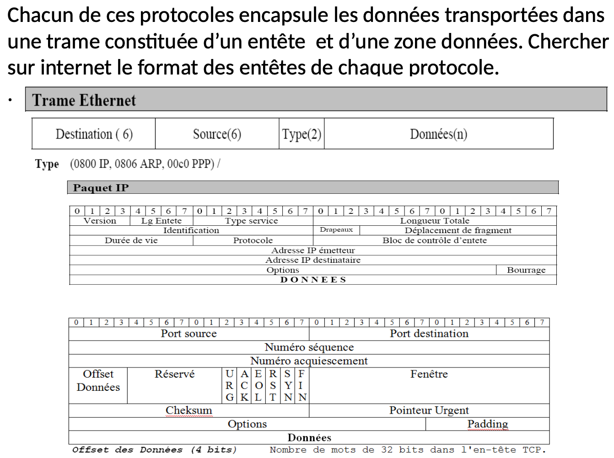

TD 1 – Découverte du modèle en couches - OSI 

Question 1 : 

1. Les couches 1 et 2 sont uniquement locales alors que les couches 3 et 4 permettent de communiquer avec des réseaux externes via le routeur en couche 3 et la stabilisations en couche 4. 

2. Les couches essaaient de corriger les erreurs ou défauts des couches en dessous. 

3. Le protocole TCP est rattaché à la couhce 4, l'IP à la 3 et l'ethernet au niveau 2. 

4. #

5. Les segments TCP sont encapsulés par les paquets ip qui sont encapsulés par les trames ethernet. C'est encapsulation est possible grace aux en-têtes de chaque protocole. 

Question 2 : 
1. Nous aurons une tram ethernet dont les données seront un paquet ip dont les données seront un segment TCP. 

2. Il s'agit d'une organoisation en couches car plusieurs protocoles sont encapsulés et reconnus grâce à leurs en-têtes. 

3. Les données sont : 5553 45 52 20 54 4f 54 4f 0d 0a
 Soit : USER TO CR LF

4. Ces données viennent du protocole TCP. 

SARTORI Tom